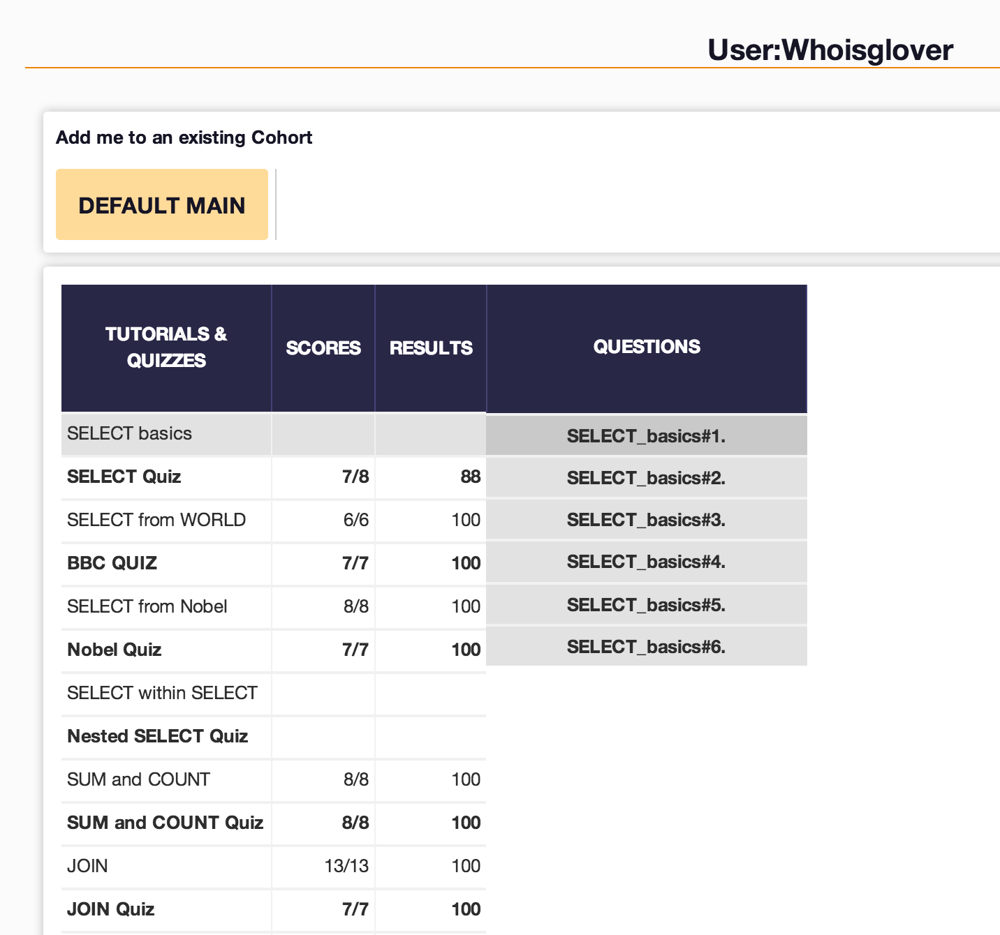

## U3.W7: SQLZoo

####I worked on this challenge by myself.

### My Quiz Results:

### Reflection

<<<<<<< HEAD
I found this challenge very interesting.  I took an entire Database class at the University of Missouri.  I had forgotten much of what I learned there but working through the sqlzoo exercises brought a lot of it back.  I've also had some experience working with relational databases and I really enjoyed it.  I like the idea of creating relationships and calculations instead of duplicating data.  I didn't have too much trouble with this challenge and I used w3schools as well as stack overflow whenever I got confused.  The one area that I think I still need more work in is the CASE functions as well as some of the more complicated nested statements.  Overall I feel confident with the learning competencies. 
=======

### Reflection

This was fairly difficult. The exercises themselves weren't so bad, but I definitely need a lot more time to wrap my mind around SQL. While most of it makes sense, there are some syntax quirks that hopefully will get easier with time. I spent a lot of time researching, but I still wasn't able to grasp the material to my expectations. Also, I know it gets harder than this, so I'm still looking for a better tutorial/guide to help me learn. 
>>>>>>> FETCH_HEAD
