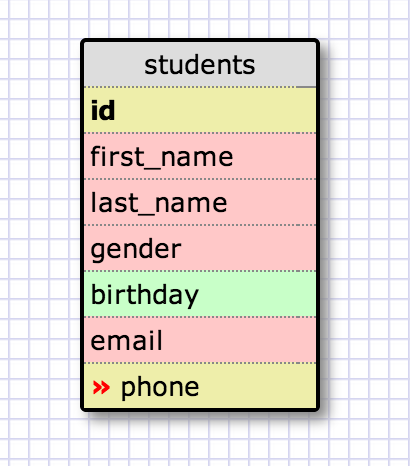
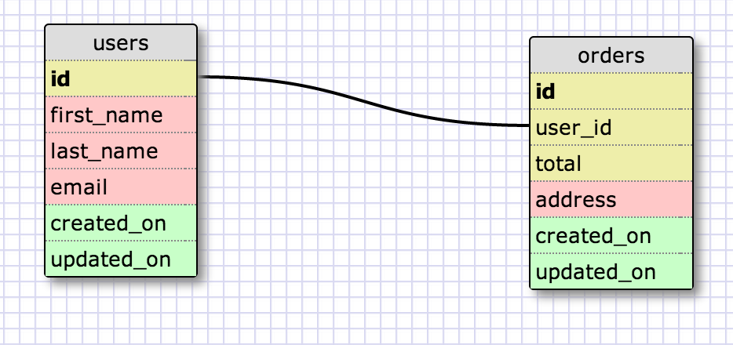
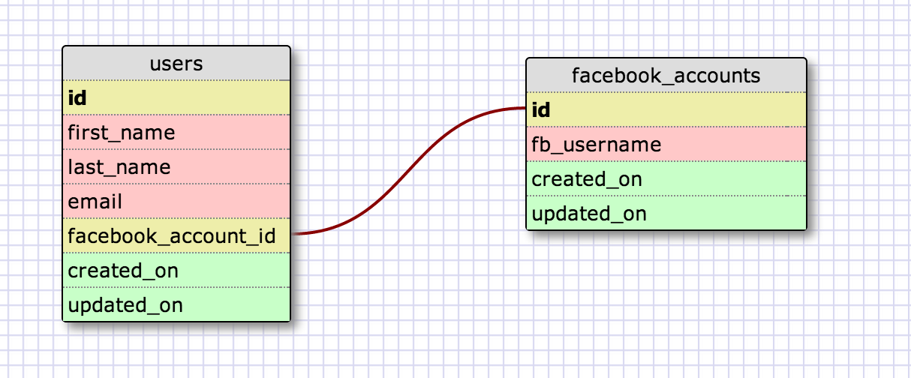
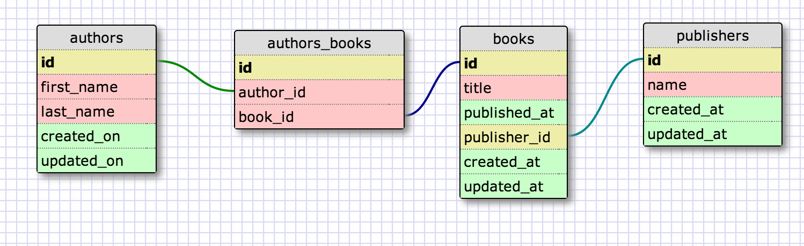
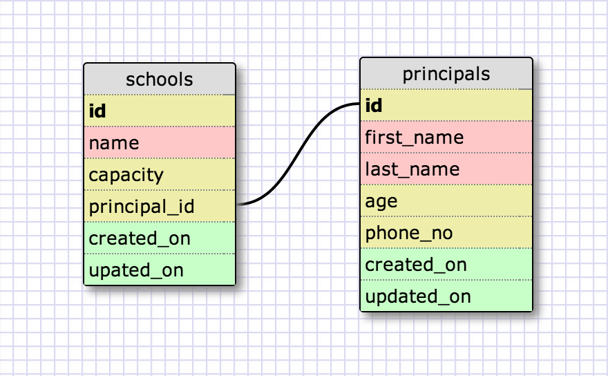
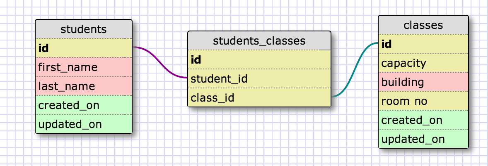

# U3.W7: Designing Schemas

#### I worked on this challenge by myself.

## Release 0: Student Roster Schema
<!-- display your image inline here -->

## Release 1: One to Many Schema
<!-- display your image inline here -->

## Release 2: One to One Schema
<!-- display your image inline here -->

## Release 3: Many to Many Schema
<!-- display your image inline here -->

## Release 4: Design your own Schema
Description of what you're modeling: 
I decided to model a school.  For the many to many I represent classes and students.  Students are enrolled in many classes and each class has many students in it.  For the one to one schema I modeled schools and principals.  Each school has a single principal and each principal is responsible for one school. 

<!-- display your one-to-one image inline here -->

<!-- display your many-to-many image inline here -->

## Release 5: Reflection
This was a fun challenge.  Creating relational databases was part of my last job and I really enjoyed it.  My boss was a huge stickler for avoiding duplication of data.  This has given me some good habits for creating schemas that I’ve noticed a few of my peers at school don’t worry about.  I didn’t have any trouble completing this challenge and I didn’t use any resources outside of the instructions and examples provided on github.  I feel good about the learning competencies for this challenge.  On to the next one!