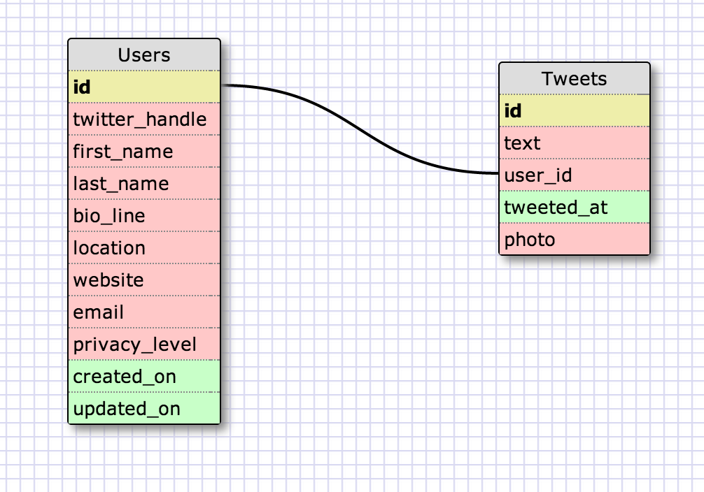

# U3.W7: Modeling a Real-World Database (SOLO CHALLENGE)

## Release 0: Users Fields
<<<<<<< HEAD
<!-- Identify the fields Twitter collects data for -->
#####Users:
- username
- first_name
- last_name
- bio_line
- location
- website
- is_protected

=======
1. Username
2. Email
3. Name
4. Location
5. Website
6. Bio
7. Following
8. Followers
9. Favorites
10. Lists
>>>>>>> FETCH_HEAD

## Release 1: Tweet Fields

1. Text (upto 140 characters, but at least 1 character)
2. Photo
3. Location

#####Tweets:
- text
- tweeted_by
- tweet_time
- photo
- mentions?

## Release 2: Explain the relationship
<<<<<<< HEAD
The relationship between `users` and `tweets` is: one to many.
Every tweet has a unique author, and each user can create many tweets (millions!).  This means one user, many tweetes -> one to many.  The tweet must have a many to many relationship for mentions but I think that is beyond the scope of our learning at this point, or I just haven't figured it out.
<!-- because... -->
=======
The relationship between `users` and `tweets` is: 

Each user has many tweets, but each tweet belongs to only one user, so it's a one-to-many relationship. 
>>>>>>> FETCH_HEAD

## Release 3: Schema Design
<<<<<<< HEAD
<!-- Include your image (inline) of your schema -->

## Release 4: SQL Statements
<!-- Include your SQL Statements. How can you make markdown files show blocks of code? -->
- all the tweets for a certain user id
	- SELECT * FROM tweets WHERE user_id = "target"

- the tweets for a certain user id that were made after last Wednesday (whenever last Wednesday was for you)
	- 	SELECT * FROM tweets WHERE user_id = "target" AND tweeted_at > 5-14-2014 SORT BY tweeted_at
- all the tweets associated with a given user's twitter handle
	- SELECT * FROM tweets JOIN users ON user_id=users.id 	 
- the twitter handle associated with a given tweet id
	- SELECT twitter_handle FROM users JOIN tweets ON user_id = users.id WHERE id = "target"	 

## Release 5: Reflection
<!-- Be sure to add your reflection here!!! -->
I felt good about this challenge.  I find it very interesting to try to imagine how real world websites organize their data, especially large ones like twitter.  I think this is a subject that most people don’t think about until they start studying computer science, and then you can’t stop seeing databases everywhere!  One question I have is how twitter handles the many to many relationship between a tweet and the users that are mentioned in that tweet.  I plan on doing some independent research on this when I have some more free time.  I didn’t have any technical questions while completing this challenge and I feel very confident with the learning competencies thus far.
=======

## Release 4: SQL Statements
<!-- Include your SQL Statements. How can you make markdown files show blocks of code? -->
1. SELECT * FROM tweets WHERE user_id = 1 (or any number)
2. SELECT * FROM tweets WHERE created_at >= '4/15/2014 12:00:00 AM' 
3. SELECT * FROM tweets JOIN users ON user_id = id WHERE twitter_handle = "lrock"
4. SELECT twitter_handle FROM users JOIN tweets ON id = user_id WHERE id = 5

## Release 5: Reflection

This was a good exercise, but the SQL statements part was the only one that gave me trouble. I'm not really comfortable with them yet, and because I can't see the results, I'm not sure that they're even right. I ended up trying to research join, since that seems to be how to get info from more than one table, but it only confused me further. Oh well, patience and practice, I guess. 
>>>>>>> FETCH_HEAD
