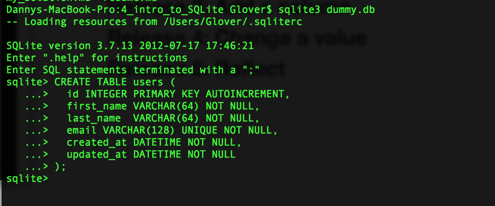
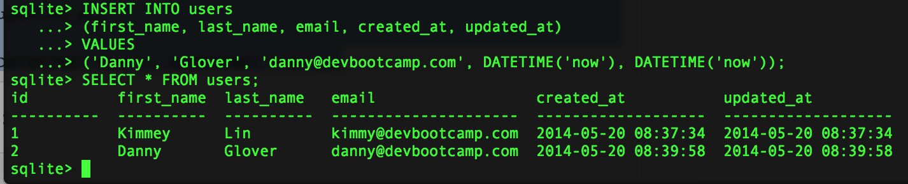
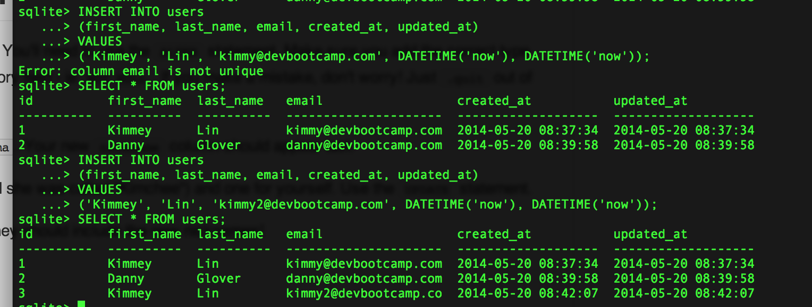
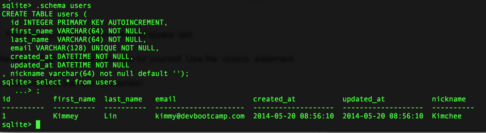
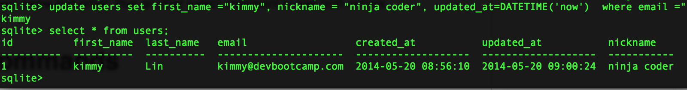

# U3.W7: Intro to SQLite

## Release 0: Create a dummy database
<!-- paste your terminal output here -->

## Release 1: Insert Data 
<!-- paste your terminal output here -->

## Release 2: Multi-line commands
<!-- paste your terminal output here -->

## Release 3: Add a column
<!-- paste your terminal output here -->

## Release 4: Change a value
<!-- paste your terminal output here -->

## Release 5: Reflect

<!-- Add your reflection here -->
I felt very confident with this challenge. My previous experience in school and work creating SQL databases helped me greatly.  I generally feel good about creating tables and queries.
One issue I ran into was adding a new field that was not null.  If the table is already created sqlite is confused as to what to put for this value in all the existing entries since it cannot be null.   I did quite a bit of stack overflow research on this and didn't really find a lot of good solutions.  What I decided to do was provide a default value when I added the field.  In this case it was a nickname so I defaulted the value to ‘’.  This seemed to fix the error I was getting earlier.  I don’t think there is a much better work around especially if the table already has quite a bit of data (starting from scratch wouldn't make sense in that case).  Other than this oddity I felt very good about this challenge and enjoyed it.