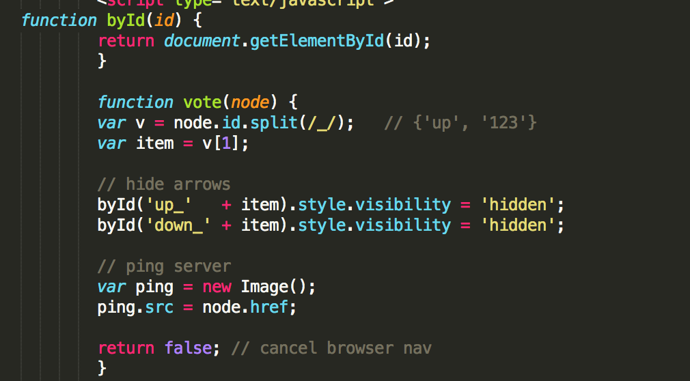

## Evaluate a Website! 
 
1) How does this website follow HTML Best Practices? Are there any places where 
it does not?  Provide examples of the "bad" code.
 - This page uses tables and divs really well to seperate each part of the page
 - It seems like a lot of their styling is done inline in the HTML instead of in the CSS page, I was always taught this was bad practice.  Here is an example:
 
            <table border="0" cellpadding="0" cellspacing="0" width="85%" bgcolor="#F6F6EF">
                <tr>
                    <td bgcolor="#FF6600">
                        <table border="0" cellpadding="0" cellspacing="0" width="100%" style="padding:2px">
                            <tr>
2) What do you think of the HTML? Did the writers use IDs and Classes properly? 
 
 - Classes were used properly but not enough in my opinion. Like I stated previously more of the styling should have been in the css page which wouldve required more classes and id's
Did you like the way they used HTML tags?  Please use examples with your arguments.
 - I don't necessarily like or dislike the way they used html tags, it was really quite standard since the entire page was pretty much tables.  I guess I did like this simplicity.. example:
 
 ` <table border="0" cellpadding="0" cellspacing="0" width="85%" bgcolor="#F6F6EF">
                <tr>
                    <td bgcolor="#FF6600">
                        <table border="0" cellpadding="0" cellspacing="0" width="100%" style="padding:2px">
                            <tr>`

3) How did the authors handle formatting? Did they include it in the HTML or 
separate it into a CSS file? Or did they do both?  Again, include examples.
 
 - Like I said before they did both but seemed to have favored the styling to be in the HTML.  The CSS page is extremely short for a full website.  See first example above.

4) Did the authors include anything you didn't immediately understand? 
If so, what?

- The authors included a function at the beginning that I don't compeletly understand.  It has something to do with fetching images from the server but I'm still not entirely sure how it works.  I think I need more experience with server side coding.
 
 
 
5) How did the authors organize the CSS file? Was it DRY?
 
 - The css file is very cleanly organized and very dry.  It is quite small for a webpage that receives this much traffic and that is because they have put most of their styling in the actual html.  The CSS page is only 65 lines long while the html is 775.
 
6) Did the authors incorporate any responsive design into the site?

- Hacker news generally seems very static.  It looks like they did include some code in the css for smaller screens.
	
	 @media only screen and (-webkit-min-device-pixel-ratio: 2), only screen and (min-device-pixel-ratio: 2) {
  .votearrow { background-size: 10px; background-image: url("grayarrow2x.gif"); }
}

 
7) What are your overall thoughts on the HTML/CSS from this website based on 
what you've read?

- I think the html/css here is very good but like I stated earlier I wouldve put more styling into the css stylesheet rather than the html page. I think the people at hacker news know what they are doing though and there may be a reason they chose this type of design.
